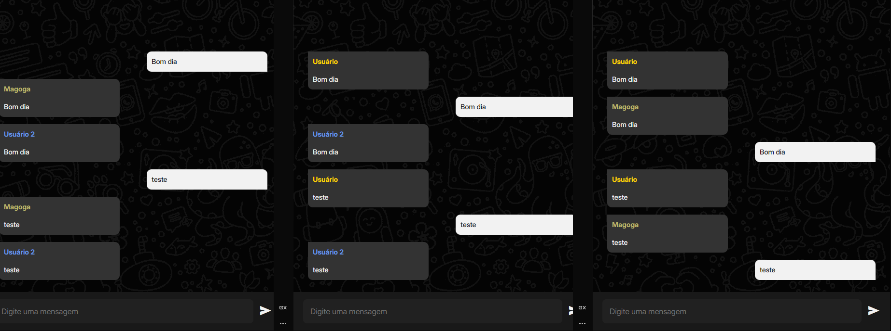

<h1 align="center">💬 Chat em Tempo Real</h1>

<h2 align="center">Acesse o <a href="https://chat-frontend-2dvg.onrender.com">chat<a/></h2>

<p align="center">
  
</p>

<p align="center">
  Projeto de <b>chat em tempo real</b> com  Node.js,  JavaScript e  HTML5.
</p>

---

## ✨ Descrição

Este projeto é um chat em tempo real, com frontend em HTML, CSS e JavaScript puro, e backend em Node.js utilizando WebSocket. Permite que múltiplos usuários conversem simultaneamente de forma simples e rápida.

---

## 📁 Estrutura do Projeto

```
backend/
  ├── .env
  ├── package.json
  └── src/
      └── server.js
frontend/
  ├── index.html
  ├── css/
  │   └── style.css
  ├── js/
  │   └── script.js
  └── images/
      └── background.png
```

---

## 🚀 Como Executar

###  Backend

```sh
cd backend
npm install
# (Opcional) Edite o .env para definir a porta:
# PORT=8080
npm start
```

###  Frontend

Abra o arquivo `frontend/index.html` no navegador.

> ⚠️ **Nota:** Para rodar localmente, altere a URL do WebSocket em `frontend/js/script.js` para `ws://localhost:8080`.

---

## ⚙️ Configuração

- Variáveis de ambiente no arquivo `.env` do backend:
  - `PORT`: Porta do servidor WebSocket (padrão: 8080).

---

## 🛠️ Funcionalidades

- 👤 Login com nome personalizado e cor aleatória.
- 💬 Envio e recebimento de mensagens em tempo real.
- 🎨 Diferenciação visual entre mensagens enviadas e recebidas.
- 📱 Interface responsiva e moderna.

---

## 🧰 Tecnologias Utilizadas

-  **HTML5**
-  **CSS3**
-  **JavaScript**
-  **Node.js**
-  **npm**
- 🔌 **WebSocket (`ws`)**
- 🔒 **dotenv**

---
Desenvolvido para fins de estudo e aprendizado.