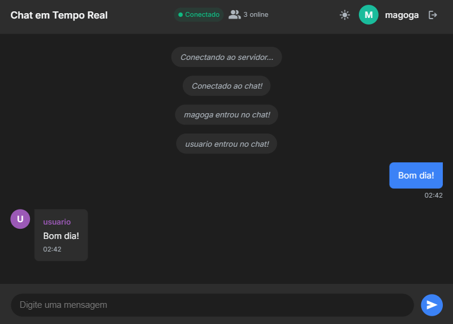

# 💬 Chat

Chat em tempo real com autenticação, tema escuro/claro, reconexão automática e deploy pronto para Vercel (frontend) e Render (backend).


## Demonstração

- Frontend: [magoga-chat.vercel.app](https://magoga-chat.vercel.app)
- Backend: [chat-9rs2.onrender.com](https://chat-9rs2.onrender.com)



---

## 🚀 Funcionalidades

- Chat em tempo real (WebSocket)
- Autenticação simples (login/cadastro)
- Tema claro/escuro
- Design responsivo
- Notificações e feedback visual
- Reconexão automática
- Limitação de taxa (anti-spam)
- Acessibilidade
- Contador de usuários online

---

## 🗂️ Estrutura do Projeto

```
chat/
├── backend/           # Servidor WebSocket (Node.js)
│   └── src/server.js
├── frontend/          # Frontend (HTML, CSS, JS)
│   ├── index.html
│   ├── css/
│   ├── images/
│   └── js/
│       ├── app.js
│       └── modules/
│           ├── auth.js
│           ├── chat.js
│           └── ui.js
└── README.md
```

---

## 🛠️ Como rodar localmente

### 1. Backend (Node.js)

```bash
cd backend
npm install
npm start
```

O backend sobe por padrão na porta 8080.

### 2. Frontend

Abra o arquivo `frontend/index.html` no navegador **ou** rode um servidor local:

```bash
cd frontend
# Python
python -m http.server 3000
# ou Node.js
npx http-server -p 3000
```

Acesse: [http://localhost:3000](http://localhost:3000)

---

## 🌐 Deploy em Produção

- **Frontend:** Deploy na [Vercel](https://vercel.com/) usando a pasta `frontend` como root.
- **Backend:** Deploy na [Render](https://render.com/) usando a pasta `backend` como root e comando `node src/server.js`.
- O frontend já está configurado para conectar ao backend da Render em produção.

---

## 📦 Tecnologias

- **Frontend:** HTML5, CSS3, JavaScript ES6+ (sem frameworks)
- **Backend:** Node.js, WebSocket (ws)

---